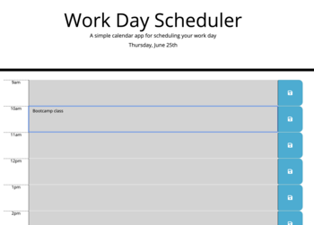

# Work Day Scheduler



This is an application that runs in browser that allows the user to input events throughout each hour of the day. These event will be stored so the user can revisit after closing browser.

## Deployed Link

* [See Live Site](https://gnoisy.github.io/05-work-day-scheduler/)

## Prerequisites

You'll need an IDE such as VS Code or Atom. Copy and paste code into your IDE and you can save file to your local drive.

```
https://code.visualstudio.com/download

https://flight-manual.atom.io/getting-started/sections/installing-atom/
```

## Built With

* [Javascript](https://developer.mozilla.org/en-US/docs/Web/JavaScript)
* [Moment.js](https://momentjs.com/)
* [jQuery](https://jquery.com/)
* [HTML](https://developer.mozilla.org/en-US/docs/Web/HTML)
* [CSS](https://developer.mozilla.org/en-US/docs/Web/CSS)

## Authors

* **Giovanni Noisy**

- [Link to Github](https://github.com/GNoisy)
- [Link to LinkedIn](https://www.linkedin.com/in/giovanni-noisy-04098989/)

### Acknowledgments

* Stack Overflow
* MDN 
* w3schools